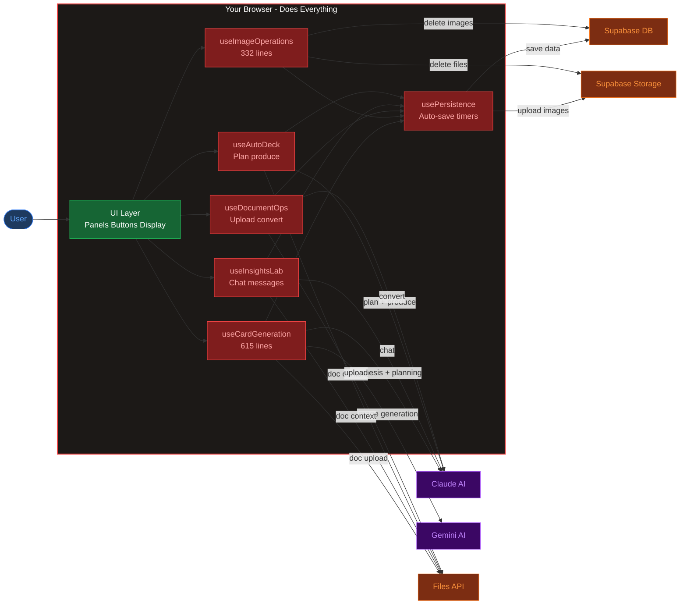

```mermaid
graph LR
    User([User]) --> UI

    subgraph Browser[Your Browser - Does Everything]
        UI[UI Layer\nPanels Buttons Display]
        CG[useCardGeneration\n615 lines]
        IO[useImageOperations\n332 lines]
        PE[usePersistence\nAuto-save timers]
        DO[useDocumentOps\nUpload convert]
        IL[useInsightsLab\nChat messages]
        AD[useAutoDeck\nPlan produce]

        UI --> CG
        UI --> IO
        UI --> DO
        UI --> IL
        UI --> AD
        CG --> PE
        IO --> PE
        DO --> PE
        IL --> PE
        AD --> PE
    end

    CG -->|synthesis + planning| Claude[Claude AI]
    CG -->|image generation| Gemini[Gemini AI]
    CG -->|doc upload| FA[Files API]
    IL -->|chat| Claude
    IL -->|doc context| FA
    AD -->|plan + produce| Claude
    AD -->|doc context| FA
    DO -->|convert| Claude
    DO -->|upload| FA
    PE -->|save data| DB[Supabase DB]
    PE -->|upload images| ST[Supabase Storage]
    IO -->|delete images| DB
    IO -->|delete files| ST

    style Browser fill:#1c1917,stroke:#ef4444,stroke-width:2px,color:#fff
    style UI fill:#166534,stroke:#22c55e,color:#fff
    style CG fill:#7f1d1d,stroke:#ef4444,color:#fca5a5
    style IO fill:#7f1d1d,stroke:#ef4444,color:#fca5a5
    style PE fill:#7f1d1d,stroke:#ef4444,color:#fca5a5
    style DO fill:#7f1d1d,stroke:#ef4444,color:#fca5a5
    style IL fill:#7f1d1d,stroke:#ef4444,color:#fca5a5
    style AD fill:#7f1d1d,stroke:#ef4444,color:#fca5a5
    style Claude fill:#3b0764,stroke:#a855f7,color:#c084fc
    style Gemini fill:#3b0764,stroke:#a855f7,color:#c084fc
    style DB fill:#7c2d12,stroke:#f97316,color:#fb923c
    style ST fill:#7c2d12,stroke:#f97316,color:#fb923c
    style FA fill:#7c2d12,stroke:#f97316,color:#fb923c
    style User fill:#1e3a5f,stroke:#3b82f6,color:#60a5fa
```
