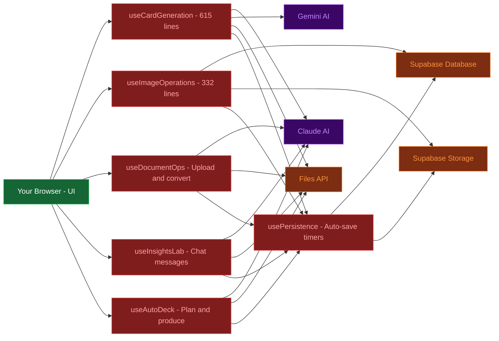
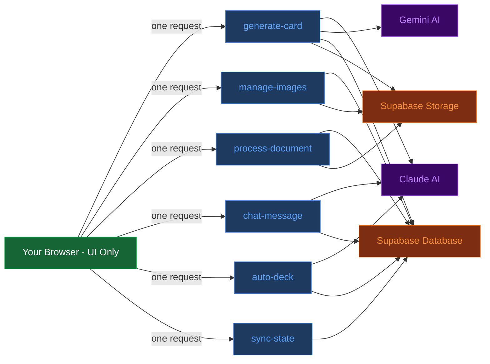
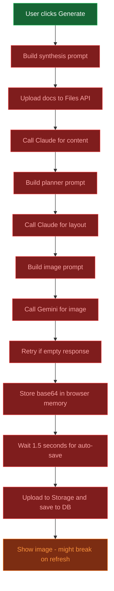
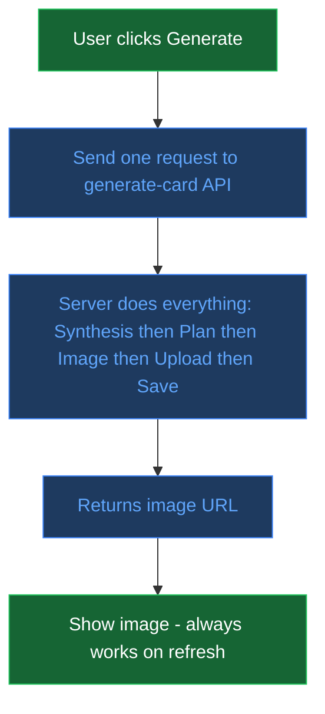

# InfoNugget Architecture Redesign

## Diagram 1: Current Architecture

## Diagram 2: Proposed Architecture

## Diagram 3: Generate Card - Before

## Diagram 4: Generate Card - After

## Diagram 5: What Stays vs What Moves

