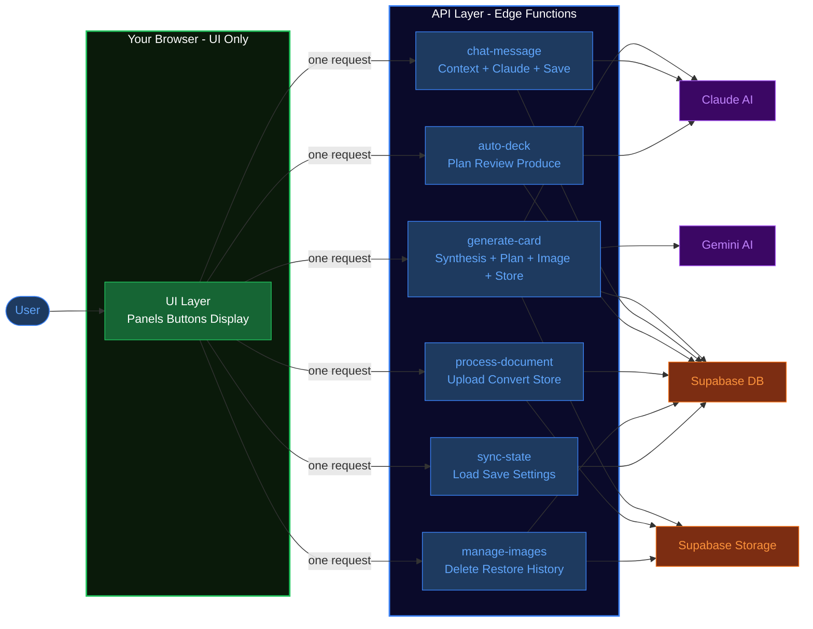

```mermaid
graph LR
    User([User]) --> UI

    subgraph Browser[Your Browser - UI Only]
        UI[UI Layer\nPanels Buttons Display]
    end

    subgraph API[API Layer - Edge Functions]
        GC[generate-card\nSynthesis + Plan + Image + Store]
        MI[manage-images\nDelete Restore History]
        PD[process-document\nUpload Convert Store]
        CM[chat-message\nContext + Claude + Save]
        AK[auto-deck\nPlan Review Produce]
        SS[sync-state\nLoad Save Settings]
    end

    UI -->|one request| GC
    UI -->|one request| MI
    UI -->|one request| PD
    UI -->|one request| CM
    UI -->|one request| AK
    UI -->|one request| SS

    GC --> Claude[Claude AI]
    GC --> Gemini[Gemini AI]
    GC --> DB[Supabase DB]
    GC --> ST[Supabase Storage]
    CM --> Claude
    CM --> DB
    AK --> Claude
    AK --> DB
    PD --> DB
    PD --> ST
    MI --> DB
    MI --> ST
    SS --> DB

    style Browser fill:#0a1a0a,stroke:#22c55e,stroke-width:2px,color:#fff
    style API fill:#0a0a2a,stroke:#3b82f6,stroke-width:2px,color:#fff
    style UI fill:#166534,stroke:#22c55e,color:#fff
    style GC fill:#1e3a5f,stroke:#3b82f6,color:#60a5fa
    style MI fill:#1e3a5f,stroke:#3b82f6,color:#60a5fa
    style PD fill:#1e3a5f,stroke:#3b82f6,color:#60a5fa
    style CM fill:#1e3a5f,stroke:#3b82f6,color:#60a5fa
    style AK fill:#1e3a5f,stroke:#3b82f6,color:#60a5fa
    style SS fill:#1e3a5f,stroke:#3b82f6,color:#60a5fa
    style Claude fill:#3b0764,stroke:#a855f7,color:#c084fc
    style Gemini fill:#3b0764,stroke:#a855f7,color:#c084fc
    style DB fill:#7c2d12,stroke:#f97316,color:#fb923c
    style ST fill:#7c2d12,stroke:#f97316,color:#fb923c
    style User fill:#1e3a5f,stroke:#3b82f6,color:#60a5fa
```
